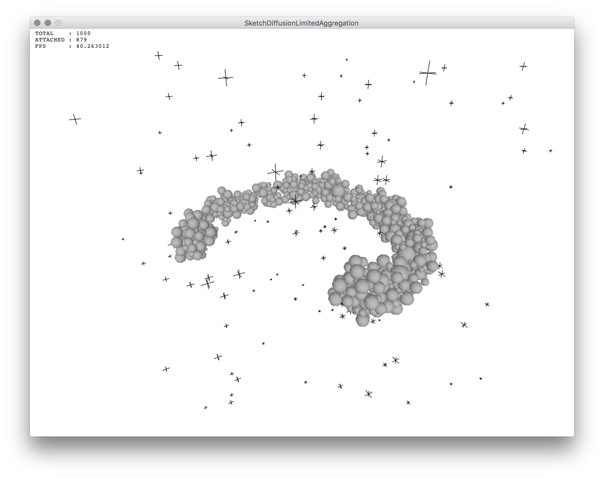

Algorithmic Clichés
===================

this repository contains a collection of _algorithmic clichés_ and according simple examples.

<!--this repository is also a collection of the material for the 5-day workshop 'Creating Systems, Processing Data, Finding Structure' in March 2013 at [HfK Bremen](http://www.hfk-bremen.de/) in the [Digital Media Programme](http://digitalemedien-bremen.de).-->

## Used Libraries

* [Processing.org](http://www.processing.org/) ( updated to version 3.0++ ) including _PDF_, _DXF_, and _Minim_ libraries
* [Teilchen](https://github.com/d3p/teilchen) on GitHub
* [Qhull](http://www.qhull.org/) for ( 2D + ) 3D voronoi diagrams ( on OS X qhull is available via [homebrew](http://brew.sh) -› ```brew install qhull``` )
* [QuickHull3D](http://www.cs.ubc.ca/~lloyd/java/quickhull3d.html) for 3D convex hulls in 3D voronoi
* [ControlP5](http://www.sojamo.de/libraries/controlP5/) for GUIs
* [Sunflow](http://sunflow.sourceforge.net/) ( this seems to be properly broken until further notice )

## Current Clichees

### Agents

[](https://github.com/d3p/algorithmic-cliches/blob/thereafter/src/de/hfkbremen/algorithmiccliches/additional/examples/SketchAgents_Step07_IntroducingTime.java)

### Cellular Automaton, Game of Life

[](https://github.com/d3p/algorithmic-cliches/blob/thereafter/src/de/hfkbremen/algorithmiccliches/additional/examples/SketchCellularAutomataGameOfLife2.java)

[](https://github.com/d3p/algorithmic-cliches/blob/thereafter/src/de/hfkbremen/algorithmiccliches/additional/examples/SketchCellularAutomataGameOfLife3.java)

### Convex Hull

[](https://github.com/d3p/algorithmic-cliches/blob/thereafter/src/de/hfkbremen/algorithmiccliches/additional/examples/SketchConvexHull3.java)

### Cubicle

[](https://github.com/d3p/algorithmic-cliches/blob/thereafter/src/de/hfkbremen/algorithmiccliches/additional/examples/SketchCubicle.java)

### Delaunay Triangulation

[](https://github.com/d3p/algorithmic-cliches/blob/thereafter/src/de/hfkbremen/algorithmiccliches/additional/examples/SketchDelaunayTriangulation.java)

### Diffusion-Limited Aggregation

[](https://github.com/d3p/algorithmic-cliches/blob/master/src/de/hfkbremen/algorithmiccliches/additional/examples/SketchDiffusionLimitedAggregation.java)

### Fast Fourier Transform

[](https://github.com/d3p/algorithmic-cliches/blob/thereafter/src/de/hfkbremen/algorithmiccliches/additional/examples/SketchFFTSimple.java)

[](https://github.com/d3p/algorithmic-cliches/blob/thereafter/src/de/hfkbremen/algorithmiccliches/additional/examples/SketchFFTLandscape.java)

### Flocking

[](https://github.com/d3p/algorithmic-cliches/blob/thereafter/src/de/hfkbremen/algorithmiccliches/additional/examples/SketchFlocking2.java)

[](https://github.com/d3p/algorithmic-cliches/blob/thereafter/src/de/hfkbremen/algorithmiccliches/additional/examples/SketchFlocking3.java)

### Fluid Dynamics

[](https://github.com/d3p/algorithmic-cliches/blob/thereafter/src/de/hfkbremen/algorithmiccliches/additional/examples/SketchFluidDynamics2.java)

[](https://github.com/d3p/algorithmic-cliches/blob/thereafter/src/de/hfkbremen/algorithmiccliches/additional/examples/SketchFluidDynamicsWaterColumns.java)

### Iso-Surface

[](https://github.com/d3p/algorithmic-cliches/blob/thereafter/src/de/hfkbremen/algorithmiccliches/additional/examples/SketchIsoSurface2.java)

[](https://github.com/d3p/algorithmic-cliches/blob/thereafter/src/de/hfkbremen/algorithmiccliches/additional/examples/SketchIsoSurface3.java)

### Octree

[](https://github.com/d3p/algorithmic-cliches/blob/thereafter/src/de/hfkbremen/algorithmiccliches/additional/examples/SketchOctree.java)

### Packing

[](https://github.com/d3p/algorithmic-cliches/blob/thereafter/src/de/hfkbremen/algorithmiccliches/additional/examples/SketchSpherePackingAroundCenter.java)

### Perlin Noise

[](https://github.com/d3p/algorithmic-cliches/blob/thereafter/src/de/hfkbremen/algorithmiccliches/additional/examples/SketchPerlinNoise.java)

[](https://github.com/d3p/algorithmic-cliches/blob/thereafter/src/de/hfkbremen/algorithmiccliches/additional/examples/SketchPerlinNoiseWaterSurface.java)

### State Machine

[](https://github.com/d3p/algorithmic-cliches/blob/thereafter/src/de/hfkbremen/algorithmiccliches/additional/examples/SketchSimpleStateMachine.java)

[](https://github.com/d3p/algorithmic-cliches/blob/thereafter/src/de/hfkbremen/algorithmiccliches/additional/examples/SketchStateMachineWithObjects.java)

### Voronoi Diagram

[](https://github.com/d3p/algorithmic-cliches/blob/thereafter/src/de/hfkbremen/algorithmiccliches/additional/examples/SketchVoronoi2.java)

[](https://github.com/d3p/algorithmic-cliches/blob/thereafter/src/de/hfkbremen/algorithmiccliches/additional/examples/SketchVoronoi2RoundRegions.java)

[](https://github.com/d3p/algorithmic-cliches/blob/thereafter/src/de/hfkbremen/algorithmiccliches/additional/examples/SketchVoronoi3.java)

## suggestions for CRB ( cliche review board )

* [reaction diffusion](https://en.wikipedia.org/wiki/Reaction–diffusion_system)
* [fractal](https://en.wikipedia.org/wiki/Fractal)

### from [Architecture 27: Tooling](https://books.google.de/books?id=MG8xfIe55t0C&pg=PA53&redir_esc=y&hl=en#v=onepage&q&f=false)

* spiraling
* packing ( in addition to *circle packing* )
* weaving
* blending
* cracking
* tiling ( in addition to *voronoi* )
